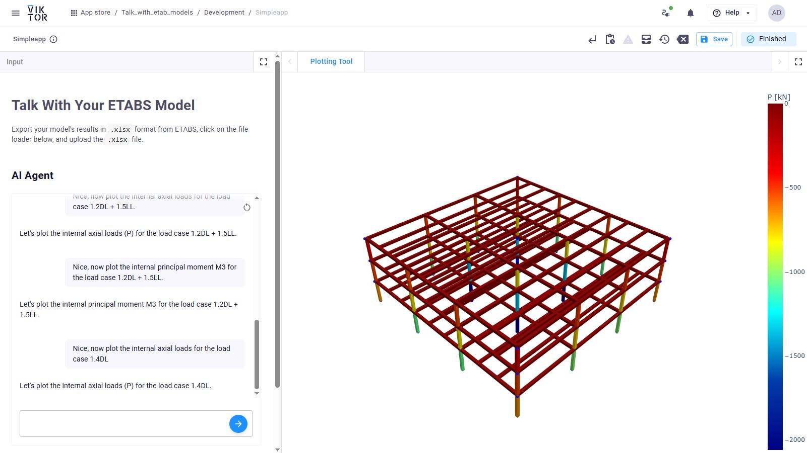

# Talk with Your ETABS Model! (Work in Progress)

## Features

This app lets you talk to your ETABS models using AI. It includes an AI agent with several tools to:

- Query model results  
- Post-process results  
- Design components based on results  

### Query Results

You can ask the AI agent many questions like:

- "List all load combinations"  
- "What is the mass of the model?"  
- "What is the lowest modal period?"  

You can even ask what the agent can do! It can also generate visuals, as shown in the sample chat below:

### Post-Process

You can not only ask for results, but also process them. For example, you can make a heat map of the reaction loads:

### Design Components

All model results are available to support design workflows. For example, the AI agent can help design pad foundations. It will ask for the soil bearing pressure and the load case, then suggest the foundation size. It can also calculate the required footing size:

## Technical Features

No third-party framework is used. All tools and prompts are created using [structured outputs](https://platform.openai.com/docs/guides/structured-outputs?api-mode=chat). The current model provider is OpenAI, but you can use any provider that supports structured output.

Refer to `.env.example` to create a `.env` file with your OpenAI key. **Do not share this API key or push it to GitHub.**
