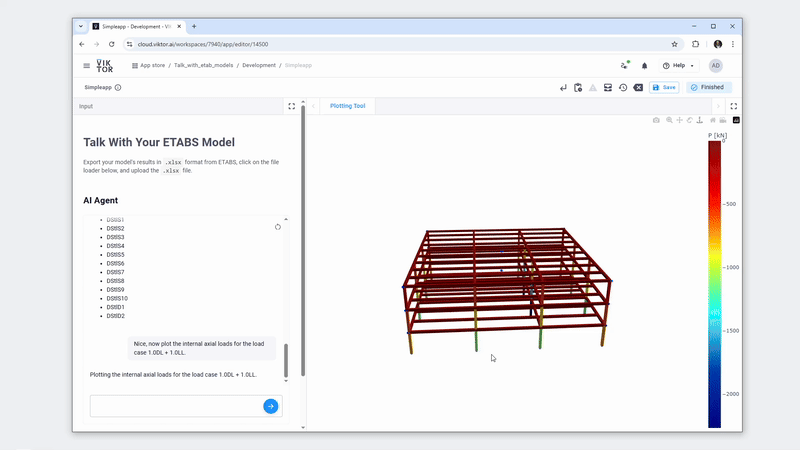

# Talk with Your ETABS Model!

## Features

This app lets you talk to your ETABS models using AI. It includes an AI agent with several tools to:

- Query model results  
- Post-process results  
- Design components based on results  

### Query Results

You can ask the AI agent many questions like:

- "List all load combinations"  
- "What is the mass of the model?"  
- "What is the lowest modal period?"  

You can even ask what the agent can do! It can also generate visuals, as shown in the sample chat below:



### Post-Process

You can not only ask for results but also process them. For example, you can make a heat map of the reaction loads, plot deformed shapes, or plot internal loads:


### Design Components

All model results are available to support design workflows. For example, the AI agent can help design pad foundations. It will ask for the soil bearing pressure and the load case, then suggest the foundation size. It can also calculate the required footing size:


## How Does the App Work?

The app needs access to the OpenAI API to function properly. It uses [structured outputs](https://platform.openai.com/docs/guides/structured-outputs?api-mode=chat), which help you retrieve data in predictable and easily manageable formats. To simplify working with structured outputs, the app leverages the [Instructor](https://python.useinstructor.com/) framework. Instructor makes it straightforward to define how you want your model responses structured. You can quickly learn how to use Instructor in just a few minutes [here](https://python.useinstructor.com/#getting-started). Additionally, Instructor provides flexibility to easily switch between different LLM providers , like [Anthropic](https://python.useinstructor.com/integrations/anthropic/), without significant code changes.

## Integration between the LLM and vkt.Views

Here's a  walkthrough of how the chat integration and visualization workflow come together:

1. First, you set up [`vkt.Chat`](https://docs.viktor.ai/docs/create-apps/user-input/llm-chat/) in your `vkt.Parametrization`, which takes care of managing user conversations. When a user submits a message, your controller gets triggered.

2. Inside the controller method linked to `vkt.Chat`, fetch the entire conversation history using `params.chat.get_messages()` and pass these messages to your LLM.

3. The conversation is sent to the LLM response endpoint. You can send it directly to the LLM provider like this: [OpenAI Quickstart](https://platform.openai.com/docs/quickstart?api-mode=responses), or use a framework like a middleman, as we did in this [app](https://github.com/viktor-platform/talk-with-your-model/blob/main/app/llm_engine.py) using [Instructor](https://python.useinstructor.com/#getting-started).

4. The LLM can respond in two ways:

   * **Plain text:** Directly update the conversation by calling:
     ```python
     vkt.ChatResult(params.chat, "Your simple reply here.")
     ```
   * **Structured data (like a tool call):** Continue with the next steps.

5. If the LLM returns structured data or a tool call, proceed to:

   6. Map the data to a corresponding function in `app/tools`.
   7. Execute the function to produce a Plotly figure.
   8. Serialize the figure to [JSON](https://plotly.com/chart-studio-help/json-chart-schema/) and save it using [VIKTOR Storage](https://docs.viktor.ai/docs/create-apps/results-and-visualizations/storing-results/):
      ```python
      vkt.Storage().set(
          "view",
          data=vkt.File.from_data(figure.to_json().encode()),
          scope="entity"
      )
      ```

9. Finally, your view (defined with [`@vkt.PlotlyView`](https://docs.viktor.ai/docs/create-apps/results-and-visualizations/plots-charts-graphs/)) retrieves the stored JSON, recreates the Plotly figure, and displays it:
   ```python
   raw = vkt.Storage().get("view", scope="entity").getvalue()
   fig = go.Figure(json.loads(raw))
   return vkt.PlotlyResult(fig.to_json())```

10. The app manages storage, deleting or updating stored data when inputs change, ensuring the views remain current.


## Handling API Keys

For local development, securely store your OpenAI API key in a `.env` file in the project's root directory (see `.env.example`). The key is loaded with the `python-dotenv` module. Always keep this key secret and never expose or commit it publicly!

For published apps, manage your API keys using VIKTOR’s environment variables. Maintainers and administrators can set environment variables via the 'Apps' menu in your VIKTOR environment. Environment variables are encrypted with AES encryption. Here's a quick overview:

* Go to the **Apps** page, find your app, and click **Details**.
* Select the **Variables** tab to add, update, or delete environment variables.
* Use the **Add Variable** button to create a new variable. Variables marked as secret cannot be read again, only deleted. Regular variables can be viewed and edited later.

For detailed instructions, please visit the official [VIKTOR environment variables documentation](https://docs.viktor.ai/docs/create-apps/development-tools-and-tips/environment-variables/).

## Useful Links for You

To help you quickly get up to speed with the app and dive deeper into specific components, here are several useful resources and tutorials:

- [Blog: How Engineers Can Use AI Agents and MCP Servers to Work Smarter](https://www.viktor.ai/blog/196/how-engineers-can-use-ai-agents-and-mcp-servers-to-work-smarter): Basic concepts about agent tools in engineering.
- [Blog: AI-powered ETABS Model Post-Processing Using Python and VIKTOR](https://www.viktor.ai/blog/200/etabs-model-post-processing-ai-python): A blog about this repo!
- [Instructor Framework – Integrations Documentation](https://python.useinstructor.com/integrations/#common-features): Explore supported integrations for different AI providers using the Instructor framework.
- [OpenAI Cookbook](https://cookbook.openai.com/): Follow step-by-step guides to work with OpenAI models.
- [VIKTOR Chat Component (`vkt.Chat`)](https://docs.viktor.ai/docs/create-apps/user-input/llm-chat/): Understand how to implement interactive LLM-based chat interfaces within your VIKTOR apps.
- [VIKTOR Storage Component (`vkt.Storage`)](https://docs.viktor.ai/docs/create-apps/results-and-visualizations/storing-results/): Learn about efficiently storing and retrieving persistent data within your apps.
- [VIKTOR Plotly View Component (`vkt.PlotlyView`)](https://docs.viktor.ai/docs/create-apps/results-and-visualizations/plots-charts-graphs/): Find out how to render interactive visualizations and charts.
